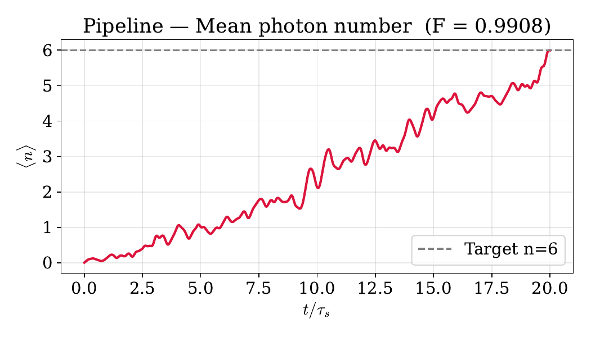
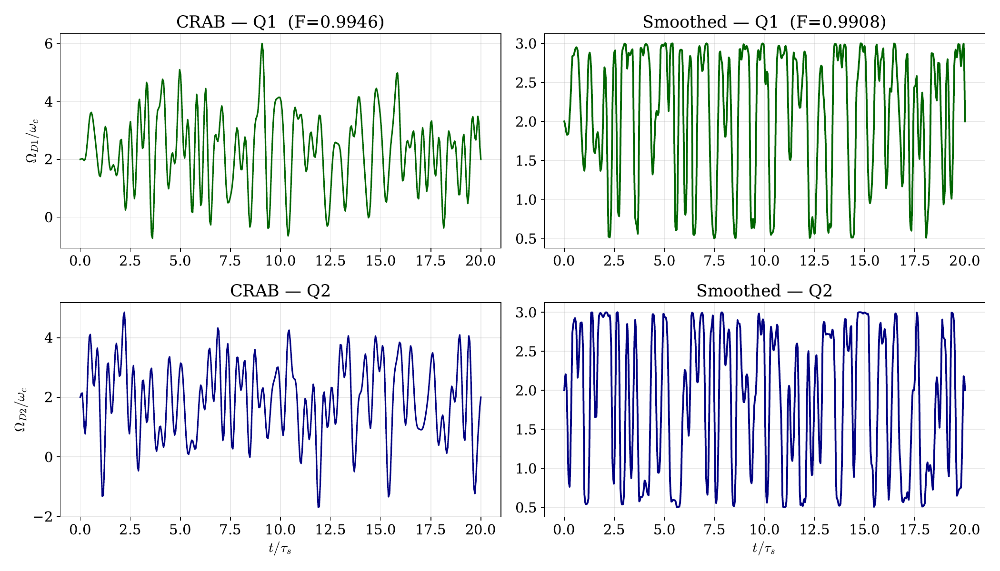
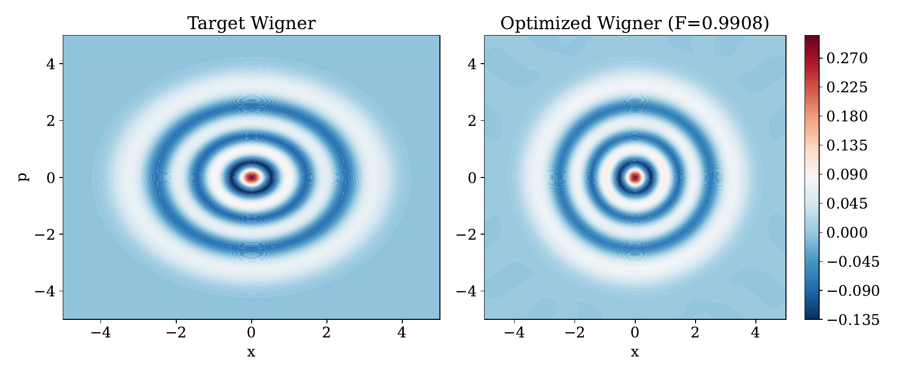
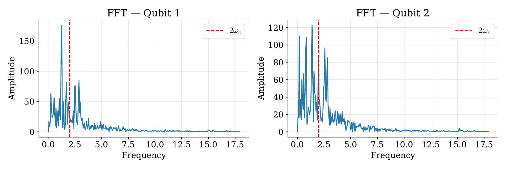

# Report Simulazione Quantum Optimal Control — 2Q

**Data e Ora Esecuzione:** 2026-09-30 14:42:12  
**Cartella:** `run_2026-09-30_14-42-12`  

## 1. Risultati Chiave
| Fase | Fedeltà ($\mathcal{F}$) | Costo Energetico ($C^2$) | Tempo Esecuzione | Iterazioni / Note |
| :--- | :---: | :---: | :---: | :--- |
| **CRAB (Miglior Seed #6)** | `0.994571` | `1293.32` | `0.0s` | Media 0.9862 ± 0.0048 |
| **GRAPE (L-BFGS-B)** | `0.999967` | `987.34` | `0.0s` | 500 iterazioni |
| **PCHIP Smoothed (Finale)** | **`0.990824`** | **`982.14`** | `0.0s` | Interpolazione fine (600 pts) |

## 2. Metriche Fisiche dell'Attuatore
| Canale | Slew Rate Max $\max|d\Omega/dt|$ | Slew Rate RMS | Costo Canale $C_k^2$ | Banda 99% $\omega_{99\%}$ |
| :--- | :---: | :---: | :---: | :---: |
| Qubit 1 | `7.341` | `1.635` | `537.52` | `5.75` $\omega_c$ |
| Qubit 2 | `6.470` | `1.737` | `444.62` | `5.27` $\omega_c$ |

## 3. Parametri di Configurazione
- **Stato Target:** Fock |n=6⟩ (Fotoni attesi $\langle n \rangle = 6.00$)
- **Dimensione Spazio Fock:** 40 (Dimensione totale: 160)
- **Durata Evoluzione $T$:** 104.720 ($T/\tau_s = 20.00$, $\tau_s = 5.236$)
- **CRAB:** 10 seeds paralleli, 20 armoniche, taglio $\omega \in [0, 3.0\omega_c]$, $N_t = 400$
- **GRAPE:** $N_t = 300$ time slots (taglio Nyquist $\omega_{\text{Nyq}} = 8.97\omega_c$), bound ampiezza (0.5, 3.0)
- **Tempo totale simulazione:** 0.0s (0.00 min)

## 4. Grafici Analitici Generati
1. **Numero medio di fotoni:** [nmean.pdf](nmean.pdf)  
   

2. **Confronto Forme d'Onda di Controllo:** [drives_comparison.pdf](drives_comparison.pdf)  
   

3. **Funzioni di Wigner (Target vs Finale):** [wigner.pdf](wigner.pdf)  
   

4. **Spettro di Fourier (FFT):** [fft.pdf](fft.pdf)  
   
