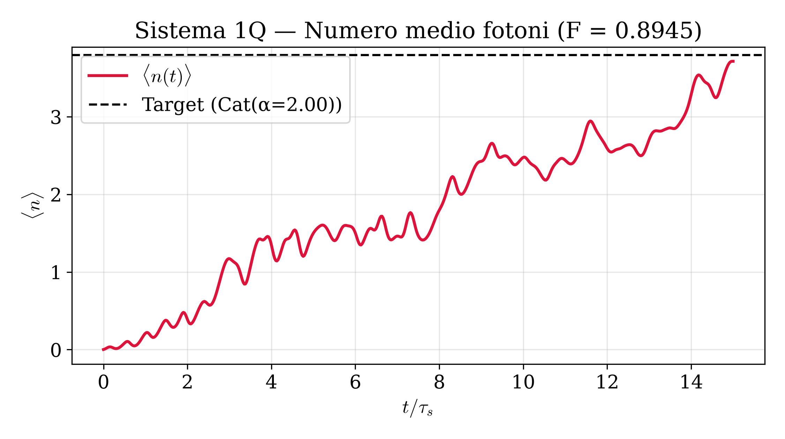
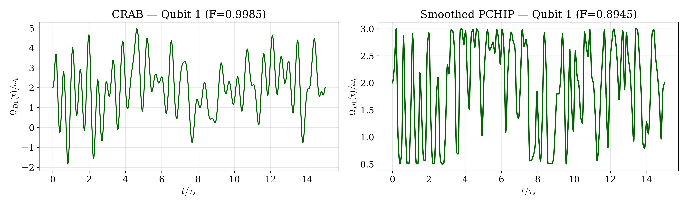
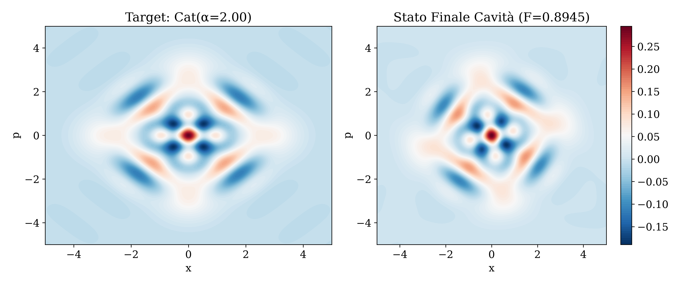
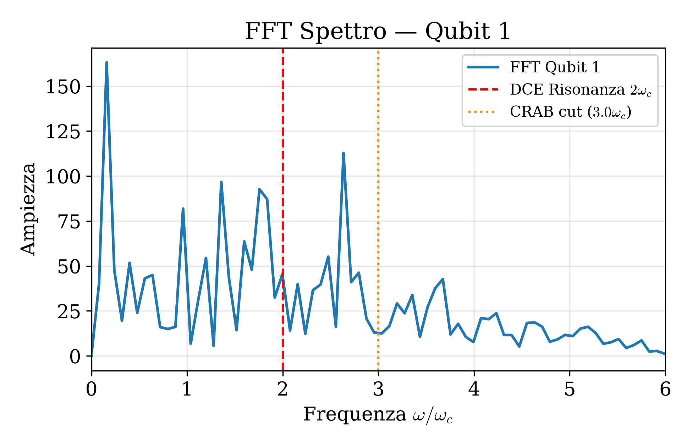

# Report Simulazione Quantum Optimal Control — 1Q

**Data e Ora Esecuzione:** 2026-10-03 15:23:26  
**Cartella:** `1q`  

## 1. Risultati Chiave
| Fase | Fedeltà ($\mathcal{F}$) | Costo Energetico ($C^2$) | Tempo Esecuzione | Iterazioni / Note |
| :--- | :---: | :---: | :---: | :--- |
| **CRAB (Miglior Seed #1)** | `0.998474` | `455.61` | `799.0s` | Media 0.9936 ± 0.0035 |
| **GRAPE (L-BFGS-B)** | `0.999351` | `347.29` | `210.4s` | 76 iterazioni |
| **PCHIP Smoothed (Finale)** | **`0.894499`** | **`340.35`** | `2.8s` | Interpolazione fine (600 pts) |

## 2. Metriche Fisiche dell'Attuatore
| Canale | Slew Rate Max $\max|d\Omega/dt|$ | Slew Rate RMS | Costo Canale $C_k^2$ | Banda 99% $\omega_{99\%}$ |
| :--- | :---: | :---: | :---: | :---: |
| Qubit 1 | `6.333` | `1.738` | `340.35` | `6.47` $\omega_c$ |

## 3. Parametri di Configurazione
- **Stato Target:** Cat(α=2.00) (Fotoni attesi $\langle n \rangle = 3.80$)
- **Dimensione Spazio Fock:** 40 (Dimensione totale: 80)
- **Durata Evoluzione $T$:** 78.540 ($T/\tau_s = 15.00$, $\tau_s = 5.236$)
- **CRAB:** 8 seeds paralleli, 20 armoniche, taglio $\omega \in [0, 3.0\omega_c]$, $N_t = 400$
- **GRAPE:** $N_t = 150$ time slots (taglio Nyquist $\omega_{\text{Nyq}} = 5.96\omega_c$), bound ampiezza (0.5, 3.0)
- **Tempo totale simulazione:** 1015.2s (16.92 min)

## 4. Grafici Analitici Generati
1. **Numero medio di fotoni:** [nmean.pdf](nmean.pdf)  
   

2. **Confronto Forme d'Onda di Controllo:** [drives_comparison.pdf](drives_comparison.pdf)  
   

3. **Funzioni di Wigner (Target vs Finale):** [wigner.pdf](wigner.pdf)  
   

4. **Spettro di Fourier (FFT):** [fft.pdf](fft.pdf)  
   
