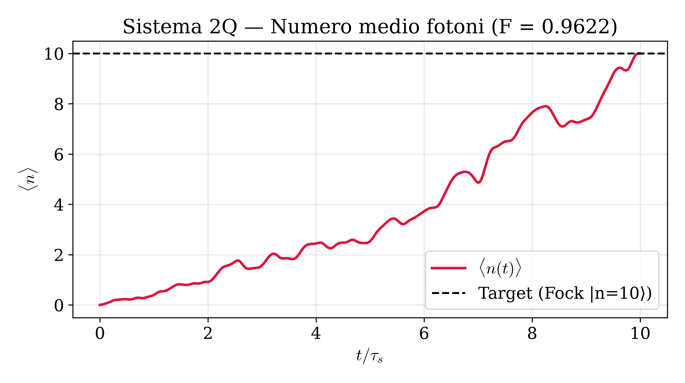
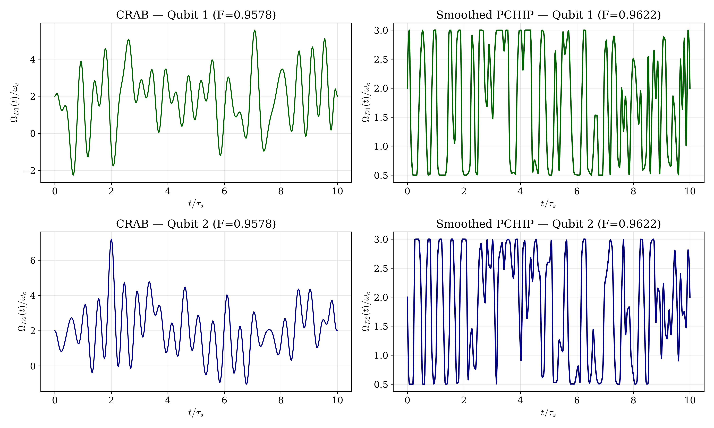
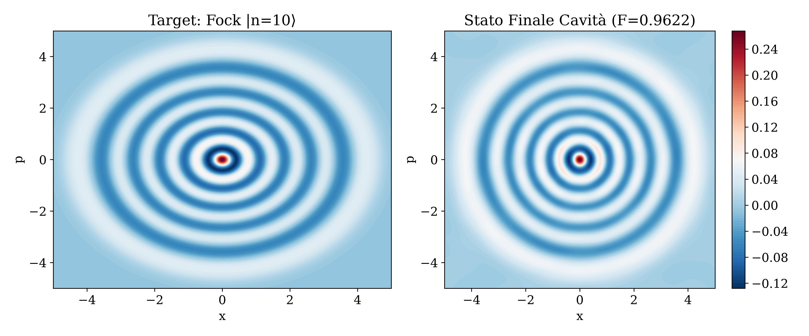
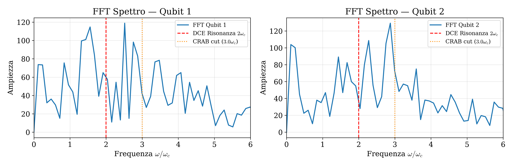

# Report Simulazione Quantum Optimal Control — 2Q

**Data e Ora Esecuzione:** 2026-10-02 17:50:04  
**Cartella:** `2q`  

## 1. Risultati Chiave
| Fase | Fedeltà ($\mathcal{F}$) | Costo Energetico ($C^2$) | Tempo Esecuzione | Iterazioni / Note |
| :--- | :---: | :---: | :---: | :--- |
| **CRAB (Miglior Seed #3)** | `0.957802` | `641.97` | `1652.0s` | Media 0.9433 ± 0.0201 |
| **GRAPE (L-BFGS-B)** | `0.998764` | `427.90` | `630.0s` | 150 iterazioni |
| **PCHIP Smoothed (Finale)** | **`0.962247`** | **`415.99`** | `6.2s` | Interpolazione fine (600 pts) |

## 2. Metriche Fisiche dell'Attuatore
| Canale | Slew Rate Max $\max|d\Omega/dt|$ | Slew Rate RMS | Costo Canale $C_k^2$ | Banda 99% $\omega_{99\%}$ |
| :--- | :---: | :---: | :---: | :---: |
| Qubit 1 | `10.264` | `3.134` | `198.82` | `10.06` $\omega_c$ |
| Qubit 2 | `10.293` | `2.898` | `217.17` | `10.06` $\omega_c$ |

## 3. Parametri di Configurazione
- **Stato Target:** Fock |n=10⟩ (Fotoni attesi $\langle n \rangle = 10.00$)
- **Dimensione Spazio Fock:** 40 (Dimensione totale: 160)
- **Durata Evoluzione $T$:** 52.360 ($T/\tau_s = 10.00$, $\tau_s = 5.236$)
- **CRAB:** 6 seeds paralleli, 20 armoniche, taglio $\omega \in [0, 3.0\omega_c]$, $N_t = 400$
- **GRAPE:** $N_t = 150$ time slots (taglio Nyquist $\omega_{\text{Nyq}} = 8.94\omega_c$), bound ampiezza (0.5, 3.0)
- **Tempo totale simulazione:** 2293.4s (38.22 min)

## 4. Grafici Analitici Generati
1. **Numero medio di fotoni:** [nmean.pdf](nmean.pdf)  
   

2. **Confronto Forme d'Onda di Controllo:** [drives_comparison.pdf](drives_comparison.pdf)  
   

3. **Funzioni di Wigner (Target vs Finale):** [wigner.pdf](wigner.pdf)  
   

4. **Spettro di Fourier (FFT):** [fft.pdf](fft.pdf)  
   
